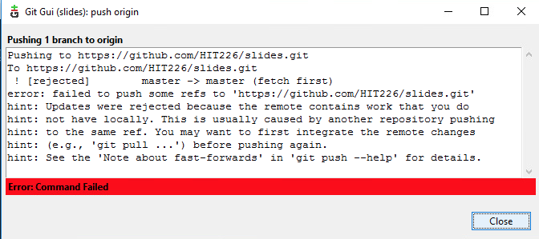
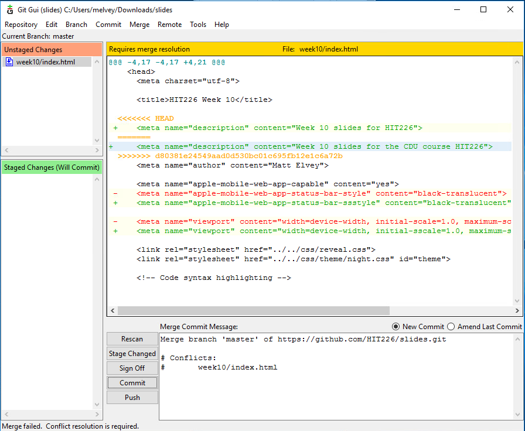
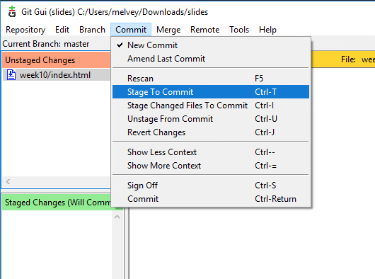
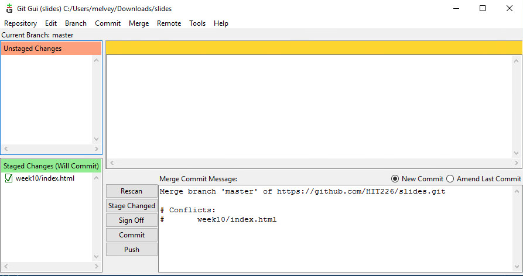
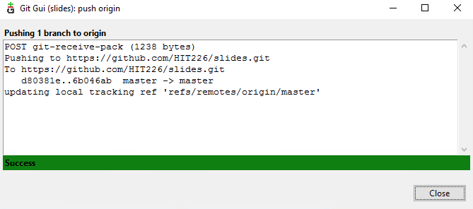

<!-- .slide: data-background-image="../images/bg-mouse.jpg" -->
# Lets Code

<!-- .slide: data-background-image="../images/bg-mouse.jpg" -->
## Coding practice
* In your teams work together to write a function that indicates which sections a user has read
* The Front-end Developer must *not* drive (someone else controls the keyboard)
* Use the [exercise on codepen](https://codepen.io/elvey/pen/zQwYgW)

<!-- .slide: data-background-image="../images/bg-mouse.jpg" -->
## Git: Merge Conflicts

<!-- .slide: data-background-image="../images/bg-mouse.jpg" -->
### Fast-forward error
* Read the message text
* Your code is not up to date with the remote repository
* Someone else has pushed since you last fetched/pulled

<!-- .slide: data-background-image="../images/bg-mouse.jpg" -->
### What do I do??
* Get the latest code (fetch and merge)
 <!-- .element: class="fragment" data-fragment-index="1" -->
 <!-- .element: class="fragment" data-fragment-index="2" -->

<!-- .slide: data-background-image="../images/bg-mouse.jpg" -->
### Merge failed??
* "fix conflicts and then commit the result"

<!-- .slide: data-background-image="../images/bg-mouse.jpg" -->
* If two people have edited the same part of the same file you get a merge conflict
* When you try to merge the file will be modified to include both versions
* You need to manually update this file to select which version you want to keep
* The "diff" will show and lines that have been added and any that have been removed

<!-- .slide: data-background-image="../images/bg-mouse.jpg" -->
## Git: Merge Conflicts

<!-- .slide: data-background-image="../images/bg-mouse.jpg" -->
### Resolve the conflict
* Open the file in Atom
* Find the following line
	* <<<<<<< HEAD
	* Your code will appear after this line
* Find the following line
	* =======
	* The server code will appear after this line
* Find the ending line
	* &gt;&gt;&gt;&gt;&gt;&gt;&gt;
	* This indicates the end of the conflict

<!-- .slide: data-background-image="../images/bg-mouse.jpg" -->
* Edit the text to include the changes you want
* Remember to delete all the marker lines
* Atom has helper buttons in you want to pick only one change

<!-- .slide: data-background-image="../images/bg-mouse.jpg" -->
### Commit your changes
* Clicking "stage all to commit" does not work for merge conflcits
* Select the file then Commit -> Stage to commit
;

<!-- .slide: data-background-image="../images/bg-mouse.jpg" -->
* now commit the merged file

<!-- .slide: data-background-image="../images/bg-mouse.jpg" -->
* You can now push to the server

<!-- .slide: data-background-image="../images/bg-mouse.jpg" -->
### Some tips to minimise conflicts
* Pull before you start work
* Commit and push regularly
* Keep your commits small
	* Work on one thing at a time
	* Your commit message should be a short sentance describing what you've done

<!-- .slide: data-background-image="../images/bg-mouse.jpg" -->
### NEVER force push

<!-- .slide: data-background-image="../images/bg-mouse.jpg" -->
## Finishing up

<!-- .slide: data-background-image="../images/bg-mouse.jpg" -->
### Make a checklist
* Create a checklist of things you need to deliver
* Before handing your project over go through your checklist
* Is there anything you forgot to double check?

<!-- .slide: data-background-image="../images/bg-mouse.jpg" -->
#### Example checklist
* Is your spelling and grammar correct
* Does your website validate
* Does it adhere to best practices
* Make sure there are no broken links
* Do all images work?

<!-- .slide: data-background-image="../images/bg-mouse.jpg" -->
### Have a finishing meeting
* Get together and discuss what you need to do
* Is anything missing?
* Has everyone finished their part?

<!-- .slide: data-background-image="../images/bg-mouse.jpg" -->
### Review your documentation
You might not look at your project again for a while. But what if you have to pick it up in a year?

Ensure your documentation tells you
* Where do you find resources?
* Who do you contact for problems?
* What guidelines does the project follow?
* Does the project have any dependencies?
	* e.g. external resources

<!-- .slide: data-background-image="../images/bg-mouse.jpg" -->
### Walk through the hosted website
* Sometimes things change when you deploy to the server
* Walk through your site and make sure it works
* Do this with your checklist
* Test on multiple devices

<!-- .slide: data-background-image="../images/bg-mouse.jpg" -->
### Iterate so your product is ready to use
* Try and design and develop your MVPs so they are ready to go
* Test your MVP, design a new one and develop it
* You can do this forever but you can also stop any time

<!-- .slide: data-background-image="../images/bg-mouse.jpg" -->
### Learn from the experience
* What lessons have you learned
* What went well?
* What didn't?
* What would you do the same or differenly
