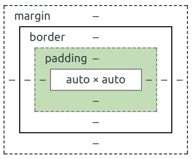
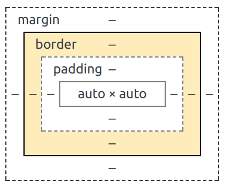
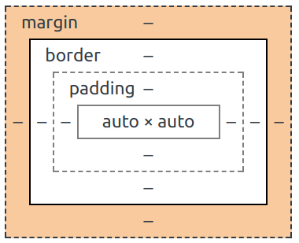

<!-- .slide: data-background-image="../images/bg-mouse.jpg" -->
# <span>Skill Up:</span> <span>Code</span>


<!-- .slide: data-background-image="../images/bg-mouse.jpg" -->
## Can you draw the page
* Have a look at the handout
* Can you draw what it looks like
	* Remember to use both the html and CSS

```html
	<link rel="stylesheet" href="css/style.css" type="text/css">
```


<!-- .slide: data-background-image="../images/bg-mouse.jpg" -->
## Box Model


Note:
https://developer.mozilla.org/en-US/docs/Web/CSS/CSS_Box_Model/Introduction_to_the_CSS_box_model


<!-- .slide: data-background-image="../images/bg-mouse.jpg" -->
### Everything is a box


Note:
In the DOM everything is a box. It might look like a circle, a triangle, a star or a love heart. But it is either a funny looking box, or a bunch of boxes stacked together.


<!-- .slide: data-background-image="../images/bg-mouse.jpg" -->
### Boxes in boxes


Note:
To make it more confusing. Everything isn't just a box, it's 4 boxes stacked inside eachother.


<!-- .slide: data-background-image="../images/bg-mouse.jpg" -->
### Box edges
* Every element has four bounds
	* content edge
	* padding edge
	* border edge
	* margin edge


<!-- .slide: data-background-image="../images/bg-mouse.jpg" -->
### Content edge
* The bounds of the actual content


Note:
* e.g.
	* Text bounds
	* image bounds
	* video bounds


<!-- .slide: data-background-image="../images/bg-mouse.jpg" -->
### padding edge
* Adds padding width to content edge



<!-- .slide: data-background-image="../images/bg-mouse.jpg" -->
### border-edge
* Adds border width to padding edge



<!-- .slide: data-background-image="../images/bg-mouse.jpg" -->
### margin-edge
* Adds margin width to border edge



<!-- .slide: data-background-image="../images/bg-mouse.jpg" -->
### Set box sizing
* To make it easy to set element size you can set

```css
* {
	box-sizing: border-box;
}
```


<!-- .slide: data-background-image="../images/bg-mouse.jpg" -->
### Activity
* Open a favourite website
* Open dev tools and explore the box-layout for an element
* Set box-sizing to content-box and set the element size
	* How big is it
* Set box-sizing to border-box and set size
	* Why is it different?


<!-- .slide: data-background-image="../images/bg-mouse.jpg" -->
## CSS Inheritance and specificity


<!-- .slide: data-background-image="../images/bg-mouse.jpg" -->
### Specificity
* When you start with CSS, you'll often find a rule you think should work, doesn't

```html
<p class="test" id="unique">Colour test</p>
```

```css
#unique {color: blue;}
p.test {color: red;}
```

* What colour is our paragraph?

[Here's the output](https://jsbin.com/rebunetiro/edit?html,css,output)  <!-- .element class="fragment" data-fragment="1" -->


<!-- .slide: data-background-image="../images/bg-mouse.jpg" -->
### Specificity Continued
* CSS tricks has a great article which covers this topic in-depth
* [https://css-tricks.com/specifics-on-css-specificity/](https://css-tricks.com/specifics-on-css-specificity/) 

* Using the method described in the article, what are the style outcomes of the following selectors?


<!-- .slide: data-background-image="../images/bg-mouse.jpg" -->
### Case 1
```html
<p class="test black large" id="unique">Colour test</p>
```

```css
#unique {color: blue;}
p.test.black.large {
	color: black;
	font-size: 30px;
}
```

What colour is our paragraph?


<!-- .slide: data-background-image="../images/bg-mouse.jpg" -->
### Case 2
```html
<ul>
	<li class="test">Colour test</li>
</ul>
```

```css
ul > .test {color: black;}
ul .test{color: red;}
```

What colour is our li?


<!-- .slide: data-background-image="../images/bg-mouse.jpg" -->
### Case 3
```html
<ul class="nav">
	<li class="test">Colour test</li>
	<li class="test not_me">Colour test</li>
</ul>
```

```css
.nav li.test{ color: blue; }
.nav > *:not(.not_me){ color: red; }
li.test { color: black; }
```

What colour is our first li?


<!-- .slide: data-background-image="../images/bg-mouse.jpg" -->
### Troubleshooting specificity
* Check the styles in dev tools
* Look at the order styles have been applied
* Are any crossed out?


<!-- .slide: data-background-image="../images/bg-mouse.jpg" -->
### Troubleshooting specificity demo
<video>
	<source data-src="videos/css-precidence-dev-tools.webm" type="video/webm" />
</video>


<!-- .slide: data-background-image="../images/bg-mouse.jpg" -->
### What is inheritance
Some CSS properties are passed down to descendant elements in the HTML document tree

```html
<p> This is a <strong>big</strong> picture</p>
```

```css
p {color: red;}
```

<p class="fragment" data-fragment="1" style="color: red">This is a <strong>big</strong> picture</p>


<!-- .slide: data-background-image="../images/bg-mouse.jpg" -->
### What is inheritance
* Children inherit from their parents


<!-- .slide: data-background-image="../images/bg-mouse.jpg" -->
### What happens
* For some CSS properties, when you style the ancestor element, the descendant elements automatically inherit those styles
	* Less work for authors
	* Smaller CSS files
	* Easier to update


<!-- .slide: data-background-image="../images/bg-mouse.jpg" -->
### Which CSS properties
* Not all CSS properties can be inherited
* Some would be annoying to have to manually turn off in all descendants
	* border
	* background-color
	* background-image
	* margin
* Some properties can have their value set to "inherit" in your CSS to add this behaviour
* [MDN Docs show which are inherited](https://developer.mozilla.org/en-US/docs/Web/CSS/Reference)


<!-- .slide: data-background-image="../images/bg-mouse.jpg" -->
## Media Queries


<!-- .slide: data-background-image="../images/bg-mouse.jpg" -->
### Task: What is a media query?
* Read one of the following articles
	* http://reference.sitepoint.com/css/mediaqueries 
	* https://css-tricks.com/css-media-queries/ 
	* https://developer.mozilla.org/en-US/docs/Web/CSS/Media_Queries/Using_media_queries 
* What can you tell me about CSS3 media queries?


<!-- .slide: data-background-image="../images/bg-mouse.jpg" -->
### Task: Getting started with media queries
* download the HTML Boilerplate From Github
	* https://github.com/HIT226/HTML-Boilerplate 
* Open typography.html in your browser
* Open main.css in your editor
* Add a media query to make all the text white and the background black, when the screen is wider than 400px
* Experiment with other styles and media queries


<!-- .slide: data-background-image="../images/bg-mouse.jpg" -->
### What can we do?
* Media queries let us apply CSS rules based on what we call media type and media features
* We can effectively tailor a page to suit the size and type of device being used.
* [MDN Docs](https://developer.mozilla.org/en-US/docs/Web/CSS/@media) outline the available options


<!-- .slide: data-background-image="../images/bg-mouse.jpg" -->
### Media types
* All
* Braille
* Embossed
* Handheld
* Print

 
* Projection
* Screen
* Speech
* Tty 
* TV


<!-- .slide: data-background-image="../images/bg-mouse.jpg" -->
### Media features
* width
* height
* device-width
* device-height
* device-pixel-ratio
* aspect-ratio
* device-aspect-ratio
 

* color
* color-index
* monochrome
* resolution
* scan
* grid
* orientation


<!-- .slide: data-background-image="../images/bg-mouse.jpg" -->
### Format of a media query
* @media selector followed by conditions (called "media features").
* CSS rules lies within the query.

```css
p {
	font-size: 16px;
}

@media(min-width: 768px) {
	font-sise: 20px;
}
```


<!-- .slide: data-background-image="../images/bg-mouse.jpg" -->
### Multiple types and features
* Use logical operators including *not*, *and*, and *','* (or) to link multiple features.

```css
@media (orientation: landscape) and (min-width: 768px) {
	body: font-size: 18px;
}

@media handheld and (min-width: 20em) {
	/* mobile styles */
}
```


<!-- .slide: data-background-image="../images/bg-mouse.jpg" -->
## Responsive design


<!-- .slide: data-background-image="../images/bg-mouse.jpg" -->
### What is responsive design
* The web page should respond to the user and their device
* Many tools
	* media queries
	* relative sizes
	* flexbox
	* scrset
	* picture element


<!-- .slide: data-background-image="../images/bg-mouse.jpg" -->
### Start with the smallest screen
* A best practice technique where you declare your most basic styles and simple layout styles first
	* This is usually a mobile phone
* This is followed by Media Queries to add more advanced formatting and layout styles
* This enables your site to 'respond' to the type of browser it is displayed in
* Use multiple Media Queries to add layers of complexity


<!-- .slide: data-background-image="../images/bg-mouse.jpg" -->
### Define the viewport
* Define the viewport meta tag in the head

```html
<meta name="viewport" content="width=device-width, initial-scale=1.0, user-scalable=yes">
```
* Width=device-width means the site adapts to the width of the screen
* Initial-scale=1 means no zoom
* User-scalable=yes means the user can choose to zoom in and out


<!-- .slide: data-background-image="../images/bg-mouse.jpg" -->
## Flexible Box Layout Module


<!-- .slide: data-background-image="../images/bg-mouse.jpg" -->
### Layout modes
* Block
* Inline
* Table
* Positioned
* Flex <!-- .element class="fragment" data-fragment="1" -->
* Grid <!-- .element class="fragment" data-fragment="2" -->


<!-- .slide: data-background-image="../images/bg-mouse.jpg" -->
### Flexbox
* Flexible positioning for flexible websites
* Newish layout mode
* A resposive way of putting boxes together


<!-- .slide: data-background-image="../images/bg-mouse.jpg" -->
### Flex Positioning
* Elements go in one direction
* You decide how they fill unused used
* And what happens when they run out of space


<!-- .slide: data-background-image="../images/bg-mouse.jpg" -->
### Have a go
* Play with the settings at one of the following pages
	* http://the-echoplex.net/flexyboxes/
	* https://codepen.io/enxaneta/full/adLPwv
* What do you think they do


<!-- .slide: data-background-image="../images/bg-mouse.jpg" -->
### Display: flex
* Set `display: flex` on the parent container
* All children will be positioned according to the flexbox


<!-- .slide: data-background-image="../images/bg-mouse.jpg" -->
### Flex direction
* Elements will be placed in the flex direction

```
.flex-container {
  flex-direction: row | column | row-reverse | column-reverse;
}
```


<!-- .slide: data-background-image="../images/bg-mouse.jpg" -->
### Wrapping
* Fit everything on one line or wrap it around

```
.flex-container {
  flex-wrap: nowrap | wrap | wrap-reverse;
}
```


<!-- .slide: data-background-image="../images/bg-mouse.jpg" -->
### Justify content
* Where to place elements in the row/column

```
.flex-container {
  justify-content: flex-start | flex-end | center | space-between | space-around | space-evenly;
}
```


<!-- .slide: data-background-image="../images/bg-mouse.jpg" -->
### Align items
* Where to put items on the cross axis
	* The cross axis is the line that crosses your flex direction

```css
.flex-container {
	align-items: flex-start | flex-end | center | baseline | stretch;
}```


<!-- .slide: data-background-image="../images/bg-mouse.jpg" -->
### Lots more to play with...
